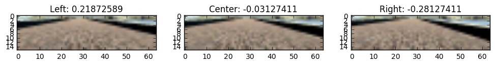
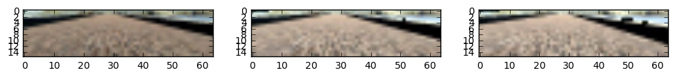
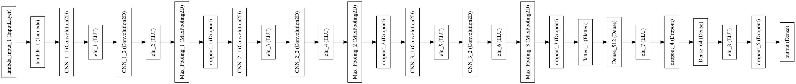

# CarND Project 3

This repo contains the work I performed for project 3 of the Udacity Self-Driving Car Nanodegree.  This goal of the project is to get a car to drive in a simulator using only images taken from the POV of the car.  A deep neural net was used, using images as input, and outputting the steering angle to be used by the vehicle. 

## Running the Simulator

The simulator was provided by Udacity. Open the simulator and select "Autonomous Mode".  Next, run the following command:

```
python drive.py model.json
```

I've also provided a [YouTube video](https://www.youtube.com/watch?v=UQxtMlkoefk) of the vehicle driving autonomously.

## Data

Due to size constraints, I have not incldued the training data in this GitHub Repo.  I had > 36,000 images to use for my training data.  I converted all images to the YUV color space, which made a huge impact on performance. 

### Data Collection

I initially used only Udacity's provided driving data, but found it insufficient for training, so I appended it with my own data.  I collected this using an Xbox 360 controller in order to get more consistent steering angles than was possible using only a keyboard.  

### Augmenting 

#### Left/Right Camera

Inspired by [this NVIDIA paper](http://images.nvidia.com/content/tegra/automotive/images/2016/solutions/pdf/end-to-end-dl-using-px.pdf), I added/subtracted 0.25 from the steering angle of the left/right images respectively.  This tripled the number of data points, and acted as "recovery" data, teaching the car to steer back to the center. 

 

#### Brightness Augmentation

I added random brightness augmentation to my training data in order to ensure the car would perform well in different lighting.  Having already converted to the YUV color space, it was easy to augment the brightness by multiplying the Y channel.

 

#### X/Y Translations Augmentation

I initially included random translations in the X/Y planes of the images for additional augmentation.  I found it difficult to tune the necessary steering angle correction per pixel shift however, and was able to successfully train the car without the translation augmentation. 

### Data Generator

I created a training and validation generator for training the model.  I used a batch size of 256 for my training data, and a validatoin size of 5000.  By using a generator, I was able to perform realtime augmentation without having to store all of the different augmentations to disk and subsequently loading them to memory.

## Neural Net

### Architecture

 

I looked toward VGGNet for inspiration when deciding on my architecture. The first layer is a lambda layer that normalizes all pixel values to [-0.5, 0.5]. There are 3 CONV blocks followed by 3 FC layers.  Each CONV block is composed of 2 CONV layers with 3x3 filters, followed by 2x2 max pooling, and a dropout layer.  The CONV block depths double from 32 to 64 to 128, forming a typical pyramid architeecture.  The FC layers have 512 and 64 neurons respectively, each also followed by a dropout layer.  For all the proceeding layers, I used the exponential linear unit activation, finding it worked better than RELUs. The final output layer is a single node with a linear activation.  I had initially used a tanh activation on the output node, as the output is constrained between -1 and 1, but found far better results with a linear activation.  

### Optimizer

I used the ADAM optimizer and mean squared error loss function.  I had to use multiple learning rates, but found that a learning rate of 0.0001 worked best in training.  I tested using weight decay to reduce overfitting, but found the use of dropout layers sufficient.

### Training

This project was a little strange in that training loss, and even validation loss was not always a great indicator of success in the simulation.  Because of this, I utilized a few callbacks to make training simpler for me:

#### Model Checkpoint

I used the ModelCheckpoint callback when training, which saved the weights after each epoch to a file containing the epoch and validation loss in the filename.  This allowed me to go through each epoch and test the model in the simulator instead of having to stop and restart the training.

#### Early Stopping

Given that validation loss wasn't a perfect indicator of success, I had to be careful with early stopping, lest it stop training prematurely.  To achieve this, I set the patience parameter to 3, which mean that 3 epochs of training would have to occur without an improvement in validation loss before early stopping would occur.  This turned out to work well as on my final training session, it stopped on epoch 11, which happened to be the version of the model that successfully drove the track.

## Conclusion

This project was extremely interesting, frustrating, and ultimately rewarding.  Some of the key lessons that I learned:

* Start with a simple model and add complexity if necessary.
* When dealing with images, try multiple color spaces.  Using YUV instead of RGB made an enormous impact on my models performance. 
* Utilize generators and realtime augmentation to improve your training data.
* Take advantage of checkpoint and early stopping callbacks.
* Tuning hyperparameters is an art and involves a lot of trial and error.
* Get a good GPU! At the end of this project I bought a GTX 1070 so I wouldn't have to deal with performing trial and error runs on my Macbook Pro anymore.